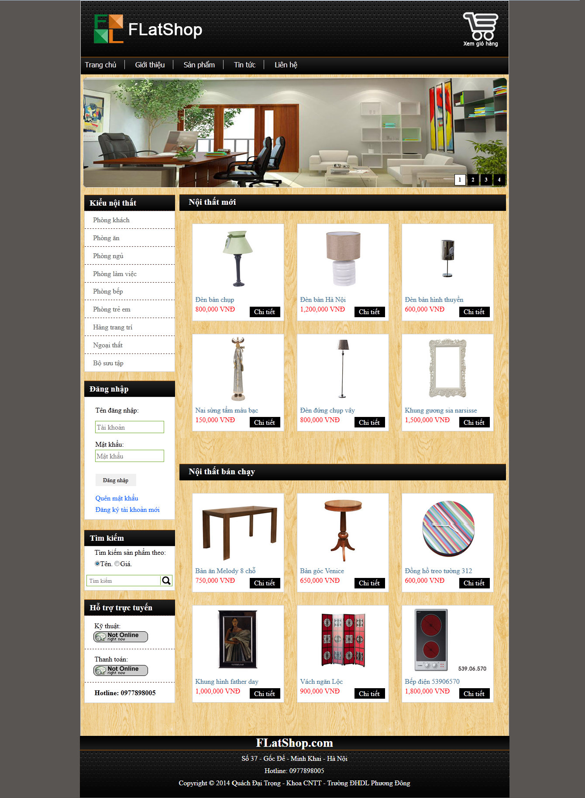

<!-- PROJECT NAME -->

  <h1 align="center">Flat Shop</h1>
  

    E-commerce website that specializes in selling furniture.
  

<!-- TABLE OF CONTENTS -->

  
Table of Contents

  <ol>
    <li>
      <a href="#about-the-project">About The Project</a>
      <ul>
        <li><a href="#built-with">Built With</a></li>
      </ul>
    </li>
    <li>
      <a href="#getting-started">Getting Started</a>
      <ul>
        <li><a href="#prerequisites">Prerequisites</a></li>
        <li><a href="#installation">Installation</a></li>
      </ul>
    </li>
    <li><a href="#sitemap">Sitemap</a></li>
    <li><a href="#contributing">Contributing</a></li>
    <li><a href="#contact">Contact</a></li>
    <li>
      <a href="#getting-started-with-create-react-app">Getting Started with Create React App</a>
    </li>
  </ol>

<!-- ABOUT THE PROJECT -->
## About The Project

