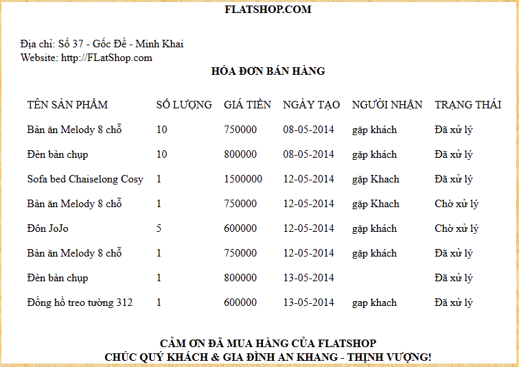

<!-- PROJECT NAME -->
<div align="center">
  <h1 align="center">FlatShop</h1>
  <p align="center">
    E-commerce website that specializes in selling furniture.
  </p>
</div>

<!-- TABLE OF CONTENTS -->
<details>
  <summary>Table of Contents</summary>
  <ol>
    <li>
      <a href="#about-the-project">About The Project</a>
      <ul>
        <li><a href="#built-with">Built With</a></li>
        <li><a href="#user-function">User Function</a></li>
        <li><a href="#admin-function">Admin Function</a></li>
      </ul>
    </li>
    <li>
      <a href="#getting-started">Getting Started</a>
      <ul>
        <li><a href="#prerequisites">Prerequisites</a></li>
        <li><a href="#installation">Installation</a></li>
      </ul>
    </li>
    <li><a href="#sitemap">Sitemap</a></li>
    <li><a href="#contributing">Contributing</a></li>
    <li><a href="#contact">Contact</a></li>
    <li>
      <a href="#getting-started-with-create-react-app">Getting Started with Create React App</a>
    </li>
  </ol>
</details>

<!-- ABOUT THE PROJECT -->
## About The Project

This is an e-commerce website specializing in furniture selling services.

<!-- BUILT WITH -->
### Built with
This project is built with the following add-on/plugins:
- 
- 
- 
- 
- 
- 
- 
- 
- 
- 

<!-- USER FUNCTION -->
### User function
1. Registration function:</br>


2. Login function:</br>


3. Cart function:</br>


4. Order function:</br>


5. Product search function:</br>
- Search products by keyword:</br>

- Search products by price:</br>


6. Product details function:</br>


7. Product category function:</br>


8. News function:</br>


<!-- ADMIN FUNCTION -->
### Admin function


1. Add product function:


2. Edit/Delete product function:


3. Search product funcrion:


4. Add product category function:


5. Edit/Delete product category function:


6. Search product category function:


7. Order list function:


8. Product list function:


9. Employee management function:


10. News management function:


11. Customer management function:


12. Slide photo management function:


13. Reports and statistics functions:</br>
- Goods quantity:


- Monthly profit statistics function:


- Quarterly profit statistics function:


- Annual profit statistics function:


- Total number of items sold:


<!-- PREREQUISITES -->
### Prerequisites
The project is based on .

<!-- INSTALLATION -->
### Installation
1. Clone the repo:
```
git clone https://github.com/daitrongquach/Flat-Shop.git
```
